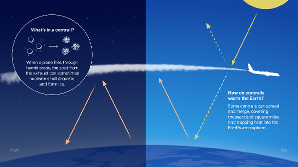
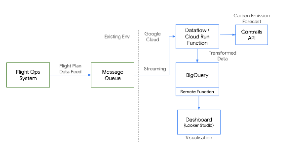
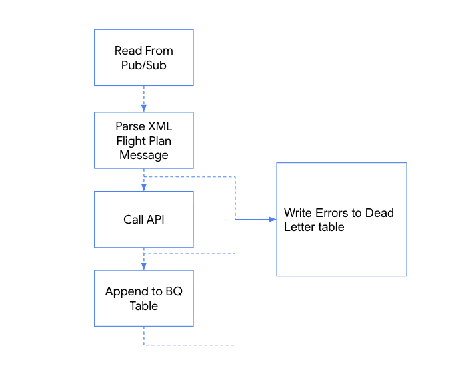
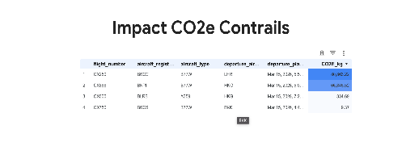

# Contrail Avoidance Playbook

<!-- Copyright 2026 Google LLC -->

## Introduction

The primary goal of this guide is to enable easy onboarding to navigational contrail avoidance, helping your airline reduce their climate impact and gather operational insights related to non-CO₂ aviation effect, even if your team is entirely new to the field. This document provides an introduction to the available tools, identifying high-impact flights, and executing efficient avoidance strategies. The following sections will define the climate impact of contrails, explain the mechanics of avoidance, and outline how to prioritize and plan these flights.

### What are contrails?

Before exploring avoidance strategies, it is important to define what contrails are. Contrails — short for condensation trails — are formed when an aircraft passes through specific atmospheric conditions, leaving behind ice crystals. Under certain temperature and humidity conditions, these trails can become "persistent," meaning they last long enough to spread and form cirrus-like cloud cover. These persistent contrail clouds can trap outgoing heat from the Earth, contributing to climate warming.



### The climate impact of contrails

Contrail avoidance focuses on managing this non-CO₂ climate impact of aviation. This is a critical undertaking, as non-CO₂ effects are a significant contributor to the sector's current warming, with contrails alone responsible for roughly **35% of the total warming**. Operational contrail avoidance aims to reduce the likelihood of producing these persistent contrails.

Crucially, not all persistent contrails have the same environmental effect. The potential warming impact of a specific flight depends on a complex interplay of variables. One of the most significant factors is the time of day: contrails formed at night trap outgoing heat from the Earth without the offsetting benefit of reflecting incoming sunlight, resulting in a much stronger net warming effect. Other critical variables include geographic location, seasonal weather patterns, and the specific temperature and humidity depth of the atmospheric layer. Because these conditions must perfectly align to create long-lasting, heat-trapping clouds, only a small fraction of flights ultimately generate a massive climate impact.

### Vertical navigational avoidance

Persistent contrails form in specific atmospheric layers that are **"pancake-shaped"**—wide horizontal areas but relatively shallow in vertical depth. This structure is key to mitigation, enabling vertical navigational avoidance, where relatively small changes in altitude are often sufficient to move the aircraft above or below the conditions where contrails are most likely to form. While lateral avoidance (small horizontal deviations) is also possible, it is typically more constrained by airspace design and traffic density.

The goal is to identify opportunities where these altitude adjustments can mitigate risk without significant fuel penalties.

### Prioritizing flights

Since it is operationally demanding to manually analyze every single flight, the recommended strategy is highly targeted. Globally, research indicates that just **~2-3% of all flights are responsible for approximately 80% of the warming effect** caused by persistent contrails¹. By focusing our attention purely on this small subset of high-impact flights we can achieve disproportionately large environmental benefits with minimal network disruption.

To facilitate this, Google provides tools to help stack-rank flights. This ensures dispatchers can easily identify where a highly localized, small operational tweak will yield a massive reduction in warming, without being overwhelmed by manual analysis or complex workflows.

### Flight planning

When it comes to operational execution, flight planning capabilities vary across the industry. Some advanced flight planning systems, such as FlightKeys, now feature built-in contrail optimization. In these environments, contrail risk is seamlessly treated as an additional planning dimension directly within the dispatcher's standard workflow.

However, other widely used flight planning software providers do not yet have contrail avoidance fully integrated into their operational products. To bridge this gap, Google provides complementary decision-support tools that operate alongside these existing systems. These external tools analyze atmospheric forecasts to pinpoint regions with high contrail probability, enabling dispatchers and flight planners to manually generate and review adjusted trajectories to safely avoid these zones before filing the final flight plan through their normal dispatch procedures.

## Executing contrail avoidance

### Identifying high-impact flights: The data pipeline

This strategy is designed to be low-touch. For flight planners and dispatchers, the daily workflow is highly streamlined. To enable this seamless daily operation, there is an initial, one-time technical integration required to establish the automated data pipeline. Once your IT or engineering team completes this setup, the ongoing operational execution requires minimal additional work.

To successfully execute a targeted contrail avoidance strategy, dispatchers need a systematic way to separate high-impact flights from the rest of the daily schedule. This process begins with your flight plans and relies on automated data analysis to surface the best opportunities.

#### Understanding flight plans and CO₂e

A flight plan is a detailed trajectory that outlines the lateral route, altitudes, and speeds an aircraft will fly from departure to destination. Because manually cross-referencing every daily flight plan against complex atmospheric weather models is operationally impossible, this can be automated using a data pipeline.

When analyzing these plans, Google's solution measures the environmental impact using **CO₂e (carbon dioxide equivalent)**. CO₂e is a standard metric that translates the short-term, intense warming effect of persistent contrails into an equivalent amount of carbon dioxide. This allows airlines to make "apples-to-apples" comparisons between the climate cost of a contrail and the CO₂ emitted from the extra fuel burned to avoid it.

This CO2e calculation varies significantly depending on the aircraft's 4D trajectory and specific atmospheric conditions. The underlying models factor in weather data, time of day, and the expected thickness and lifespan of the contrail to determine its exact heat-trapping potential before converting it into this comparable metric.

### The Trajectory API pipeline

To stack-rank flights by their potential warming impact, your IT team can set up an integration built around the **Contrails Trajectory API**. Here is how the process works:

1. **Data integration:** Flight plan data from your flight planning  system (such as LIDO) is streamed into a central data platform.
2. **Data enhancement:** The pipeline feeds all these planned trajectories through the Contrails Trajectory API. This API evaluates the 4D flight path (latitude, longitude, altitude, and time) against high-resolution meteorological forecasts to predict if, when, and where persistent contrails are likely to form.
3. **Scoring and ranking:** The API returns a forecasted contrail impact score measured in CO₂e for every single flight. Crucially, it also generates a direct link to [**Contrails Explorer**](https://contrails.webapps.google.com/), a visual interface used to review the specific contrail forecast for that flight.
4. **Data analysis:** Dispatchers can then view this enriched data in their preferred dashboard. By sorting the daily schedule by CO₂e, dispatchers can easily identify the flights with the highest warming potential. For operational trials, airlines employ different strategies; most do not attempt avoidance on every flight, but rather select an appropriate number of high-impact flights to test based on their specific trial needs and operational capacity.

### Manual navigational avoidance with Contrails Explorer

Once a high-impact flight is selected, the flight planner adjusts the route to mitigate the contrail risk. For airlines using flight planning software that does not currently support automated avoidance, this is done using [**Contrails Explorer**](https://contrails.webapps.google.com/).

Contrails Explorer is a visual decision-support user interface that allows flight planners to view a filed flight plan directly overlaid onto a forecasted contrail map. It provides a detailed vertical profile view of the flight, highlighting exactly where the trajectory intersects with contrail-prone "pancake" layers. This vertical perspective is the primary view used to plan and execute avoidance maneuvers.

#### Step-by-step manual avoidance

With a high-impact flight identified, the dispatcher executes the following manual workflow:

* **Input the flight:** Enter the flight plan details into the Contrails Explorer interface or click the direct link generated by the API pipeline.
* **Visually correlate:** Examine the vertical profile view to see exactly which flight levels and waypoints intersect with the forecasted contrail zones.
* **Iterate the trajectory:** Test alternative altitudes by adjusting step climbs or descents at the affected waypoints. The goal is to find a route that navigates the aircraft above or below the contrail layer with the minimum necessary deviation.
* **Apply domain knowledge:** In Google's previous airline trials, it was established that flight planners can use this tool with ease to adjust the trajectory manually. Planners rely on their operational expertise to ensure the new altitude profile is safe, feasible, and operationally sound.
* **File the updated plan:** Once an optimal vertical path is found, the new altitude changes can simply be copy-pasted or replicated within your primary flight planning software (e.g., LIDO).
* **Validate and submit:** Run standard operational checks, validate the new trajectory with the relevant aviation safety authority (e.g. EUROCONTROL), and officially submit the updated flight plan.

## Suggested implementation

When establishing the data pipeline described earlier, we found that utilizing a Google Cloud Platform (GCP) integration can significantly increase the ease and speed of setup. Below, we provide a reference architecture. It is important to note that while this example uses GCP, a similar setup can be also reproduced using other cloud providers, such as AWS, for airlines not currently operating on Google Cloud.

This section describes a cloud-based solution for airline partners to ingest flight plans, calculate their CO₂e impact via the Contrails API, and store the results in BigQuery for stack-ranking and trial selection analysis.

If your team is interested in exploring Google Cloud as your primary solution, please let us know. We are happy to expand this guide with detailed code snippets and further technical specifications to help your engineering team get the pipeline up and running smoothly.

### Architecture Overview



#### Google Cloud infrastructure

* [**GCP Pub/Sub**](https://cloud.google.com/pubsub): A fully managed, serverless, asynchronous messaging service that decouples senders (publishers) and receivers (subscribers). It enables real-time data streaming and event-driven architectures, automatically scaling to handle millions of messages per second. It ensures high reliability with at-least-once message delivery and effectively decouples airline systems from the processing layer.
* [**Cloud Functions (2nd gen)**](https://cloud.google.com/functions): A serverless, event-driven Functions-as-a-Service (FaaS) model built on Cloud Run. It is used for the Pub/Sub-triggered process that parses the XML, calls the Contrails API, and extracts CO2e impact, offering a cost-effective alternative to Dataflow, with improved concurrency and longer timeouts.
* [**BigQuery**](https://cloud.google.com/bigquery): SQL-based analytics platform that handles million-row stack-ranking queries in seconds.
* [**Looker Dashboard**](https://cloud.google.com/looker)**:** Visualizes up-to-date and live datasets.

#### Logical flow

1. **Ingest**: Flight plans (XML) are pushed to **Cloud Pub/Sub**.
2. **Process**: **Cloud Function v2** parses the XML, calls the **Contrails API**, and extracts **CO2e** impact in a few seconds.
3. **Store**: Results are stored in a partitioned history table in **BigQuery**.
4. **Visualize**: A **BigQuery View** provides the "latest" version of each flight plan for a specific dashboard.

#### Technical specifications



#### Flight plan parsing engine

The pipeline includes a specialized parser designed for **ARINC 633 Operational Flight Plan (OFP) XML** flight plans. This engine extracts waypoint-level information such as latitude, longitude, altitude, and time for the main flight plan. An open source version is available in the [pycontrails](https://github.com/contrailcirrus/pycontrails) library.

This pre-processing ensures that raw operational data is "API-ready" without requiring the partner to modify their existing flight planning exports or spending engineering work on creating the parser from scratch.

#### The Contrails API contract

To calculate the CO2-equivalent impact emissions, the pipeline converts flight plan waypoints into the required JSON format for the [Contrails API](https://developers.google.com/contrails).

```json
{
  "flight_plan": {
    "waypoints": [
      {
        "lat_lng": {"latitude": 22.3, "longitude": 113.9},
        "flight_level": 350,
        "arrival_time": "2026-04-08T10:00:00Z"
      }
    ]
  }
}
```

#### Data storage (BigQuery)
Each processed row is saved in `APPEND_ONLY` mode into a historical BigQuery table. This schema captures essential data elements such as the flight number, origin and destination ICAO codes, aircraft type and registration, planned departure and arrival timestamps, and the calculated `total_forcing_joules`.

| field name | mode | type | description |
| ----- | ----- | ----- | ----- |
| flight_identifier | NULLABLE | STRING | The alphanumeric code assigned by an airline to a scheduled flight (e.g., CA123). |
| departure_airport_icao | NULLABLE | STRING | The ICAO code for the airport where the journey originates. |
| arrival_airport_icao | NULLABLE | STRING | The ICAO code for the airport where the journey concludes. |
| aircraft_type | NULLABLE | STRING | The model or type of aircraft used for the journey. |
| aircraft_registration | NULLABLE | STRING | The unique registration identifier of the aircraft. |
| origin_date | NULLABLE | DATE | The calendar date on which the journey is scheduled to begin. |
| departure_planned_at | NULLABLE | TIMESTAMP | The planned date and time of departure. |
| arrival_planned_at | NULLABLE | TIMESTAMP | The planned date and time of arrival. |
| last_updated_at | NULLABLE | TIMESTAMP | The timestamp indicates when the journey's information was last modified. |
| total_forcing_joules | NULLABLE | FLOAT | The total expected effective energy forcing in Joules. |
| bq_last_update_timestamp | NULLABLE | DATETIME | The timestamp indicates when the record was last updated in BigQuery. |

#### Error handling

A Dead-letter queue (DLQ) in BigQuery automatically captures failed API calls, schema mismatches, and any other issues encountered during pipeline execution. An alert is optionally triggered when problematic rows are added to the DLQ to ensure rapid fault detection.

#### Visualization

To support your flight planners, a BigQuery View filters for the *latest version* of each flight plan. It is possible to use this view to power an up-to-date, live dashboard that stack-ranks flights based on their estimated CO2 equivalent impact.



```sql
SELECT
 flight_identifier,
 departure_airport_icao,
 arrival_airport_icao,
 aircraft_type,
 aircraft_registration,
 origin_date,
 departure_planned_at,
 arrival_planned_at,
 last_updated_at,
 total_forcing_joules,
 bq_last_update_timestamp
FROM `PROJECT_ID.DATASET_ID.contrails_impact_history`
QUALIFY
 ROW_NUMBER()
   OVER (
     PARTITION BY
       flight_identifier, departure_airport_icao, arrival_airport_icao, origin_date
     ORDER BY last_updated_at DESC
   )
 = 1
ORDER BY last_updated_at DESC;
```

## Resources

¹D.S. Lee, D.W. Fahey, A. Skowron, M.R. Allen, U. Burkhardt, Q. Chen, S.J. Doherty, S. Freeman, P.M. Forster, J. Fuglestvedt, A. Gettelman, R.R. De León, L.L. Lim, M.T. Lund, R.J. Millar, B. Owen, J.E. Penner, G. Pitari, M.J. Prather, R. Sausen, L.J. Wilcox. The contribution of global aviation to anthropogenic climate forcing for 2000 to 2018, Atmospheric Environment, Volume 244, 2021, https://doi.org/10.1016/j.atmosenv.2020.117834.
